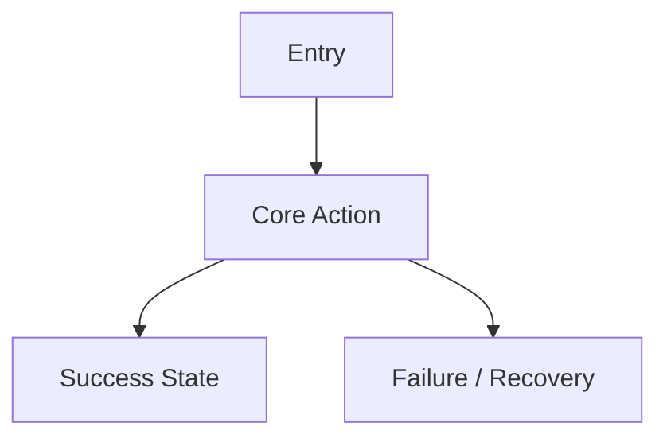
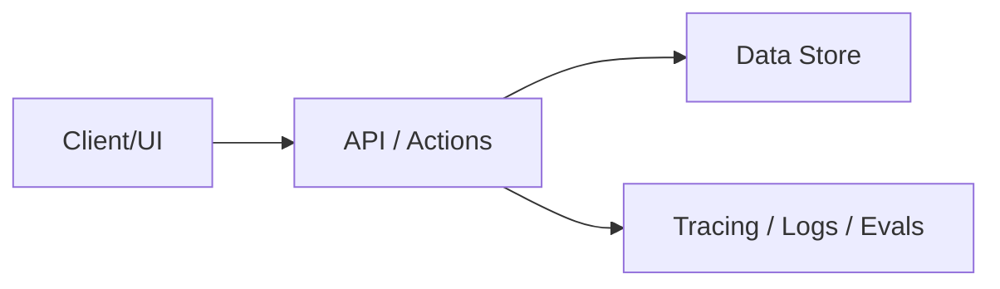

# {{PROJECT_NAME}}

{{PROJECT_SUBTITLE}}

## Background

{{BACKGROUND}}

## Brainlift Summary

| Area | Requirement Context |
| --- | --- |
| Product definition | {{PRODUCT_DEFINITION}} |
| Target users | {{TARGET_USERS}} |
| 9+/10 bar | {{QUALITY_BAR}} |
| Non-negotiables | {{NON_NEGOTIABLES}} |
| Anti-patterns | {{ANTI_PATTERNS}} |
| Max-specific constraints | {{MAX_CONSTRAINTS}} |

## Comparable-Product Research

| Comparable | Why It Matters | Borrow | Avoid | Requirements Implied |
| --- | --- | --- | --- | --- |
| {{COMPARABLE}} | {{WHY}} | {{BORROW}} | {{AVOID}} | {{REQS}} |

## Product Thesis

{{PRODUCT_THESIS}}

## Presearch Decision Matrix

| Decision | Option A | Option B | Recommendation | Why |
| --- | --- | --- | --- | --- |
| {{DECISION}} | {{OPTION_A}} | {{OPTION_B}} | {{RECOMMENDATION}} | {{WHY}} |

## Project Overview

| Milestone | Outcome | Proof |
| --- | --- | --- |
| MVP | {{MVP_OUTCOME}} | {{MVP_PROOF}} |
| Full Feature Set | {{FULL_OUTCOME}} | {{FULL_PROOF}} |
| Final Submission | {{FINAL_OUTCOME}} | {{FINAL_PROOF}} |

## MVP Requirements

| ID | Requirement | Acceptance Criteria | Evidence |
| --- | --- | --- | --- |
| MVP-001 | {{REQUIREMENT}} | {{ACCEPTANCE}} | {{EVIDENCE}} |

## Core Product Requirements

| ID | Area | Requirement | Acceptance Criteria |
| --- | --- | --- | --- |
| FR-001 | {{AREA}} | {{REQUIREMENT}} | {{ACCEPTANCE}} |

## Non-Functional Requirements

| ID | Area | Requirement | Measurement |
| --- | --- | --- | --- |
| NFR-001 | {{AREA}} | {{REQUIREMENT}} | {{MEASUREMENT}} |

## UI Flows

## Technical Architecture

## Data Model And API Requirements

| Entity/API | Requirement | Validation |
| --- | --- | --- |
| {{ENTITY}} | {{REQUIREMENT}} | {{VALIDATION}} |

## AI And Evaluation Requirements

| Requirement | Eval / Trace | Fallback |
| --- | --- | --- |
| {{AI_REQUIREMENT}} | {{EVAL}} | {{FALLBACK}} |

## Security, Privacy, And Trust Boundaries

| Boundary | Requirement | Test |
| --- | --- | --- |
| {{BOUNDARY}} | {{REQUIREMENT}} | {{TEST}} |

## Performance And Reliability Targets

| Metric | Target | Measurement |
| --- | --- | --- |
| {{METRIC}} | {{TARGET}} | {{MEASURE}} |

## Acceptance Test Plan

| ID | Scenario | Steps | Pass Criteria |
| --- | --- | --- | --- |
| AT-001 | {{SCENARIO}} | {{STEPS}} | {{PASS}} |

## Independent Review Gate

| Gate | Requirement | Result |
| --- | --- | --- |
| Artifact completeness | All required files exist | {{RESULT}} |
| Quality score | 9.0/10 or higher | {{RESULT}} |
| Visual render | PDF rendered and inspected | {{RESULT}} |

## Submission Requirements

| Artifact | Requirement | Done Criteria |
| --- | --- | --- |
| GitHub Repository | {{REQUIREMENT}} | {{DONE}} |

## Traceability Appendix

Each requirement must map to:

- source file or GitHub evidence
- comparable-product influence
- acceptance test
- known gap or risk
